---
## Front matter
title: "Отчёта по лабораторной работе 5"
subtitle: "Основы работы с Midnight Commander (mc). Структура программы на языке ассемблера NASM"
author: "Гадаборшев Заур Закреевич	НПИбд-01-23"

## Generic otions
lang: ru-RU
toc-title: "Содержание"

## Bibliography
bibliography: bib/cite.bib
csl: pandoc/csl/gost-r-7-0-5-2008-numeric.csl

## Pdf output format
toc: true # Table of contents
toc-depth: 2
lof: true # List of figures
lot: true # List of tables
fontsize: 12pt
linestretch: 1.5
papersize: a4
documentclass: scrreprt
## I18n polyglossia
polyglossia-lang:
  name: russian
  options:
	- spelling=modern
	- babelshorthands=true
polyglossia-otherlangs:
  name: english
## I18n babel
babel-lang: russian
babel-otherlangs: english
## Fonts
mainfont: PT Serif
romanfont: PT Serif
sansfont: PT Sans
monofont: PT Mono
mainfontoptions: Ligatures=TeX
romanfontoptions: Ligatures=TeX
sansfontoptions: Ligatures=TeX,Scale=MatchLowercase
monofontoptions: Scale=MatchLowercase,Scale=0.9
## Biblatex
biblatex: true
biblio-style: "gost-numeric"
biblatexoptions:
  - parentracker=true
  - backend=biber
  - hyperref=auto
  - language=auto
  - autolang=other*
  - citestyle=gost-numeric
## Pandoc-crossref LaTeX customization
figureTitle: "Рис."
tableTitle: "Таблица"
listingTitle: "Листинг"
lofTitle: "Список иллюстраций"
lotTitle: "Список таблиц"
lolTitle: "Листинги"
## Misc options
indent: true
header-includes:
  - \usepackage{indentfirst}
  - \usepackage{float} # keep figures where there are in the text
  - \floatplacement{figure}{H} # keep figures where there are in the text
---

# Цель работы

Целью работы является приобретение практических навыков работы в Midnight Commander. 
Освоение инструкций языка ассемблера mov и int.

# Теоретическое введение

Midnight Commander (или просто mc) — это программа, которая позволяет просматривать
структуру каталогов и выполнять основные операции по управлению файловой системой,
т.е. mc является файловым менеджером. Midnight Commander позволяет сделать работу с
файлами более удобной и наглядной.

Программа на языке ассемблера NASM, как правило, состоит из трёх секций: секция кода
программы (SECTION .text), секция инициированных (известных во время компиляции)
данных (SECTION .data) и секция неинициализированных данных (тех, под которые во
время компиляции только отводится память, а значение присваивается в ходе выполнения
программы) (SECTION .bss).

Инструкция языка ассемблера mov предназначена для дублирования данных источника в
приёмнике. В общем виде эта инструкция записывается в виде mov dst,src
Здесь операнд dst — приёмник, а src — источник

Инструкция языка ассемблера intпредназначена для вызова прерывания с указанным
номером. В общем виде она записывается в виде int n
Здесь n — номер прерывания, принадлежащий диапазону 0–255

# Выполнение лабораторной работы

## Знакомство с Midnight Commander

Открыл Midnight Commander, с помощью клавишь со стрелками и Enter перешел в каталог ~/work/arch-pc.
Далее нажал F7 и создал каталог lab05

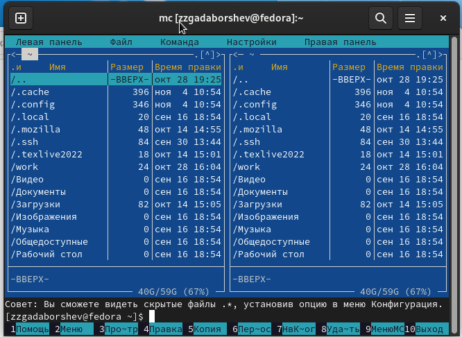{ #fig:001 width=70%, height=70% }

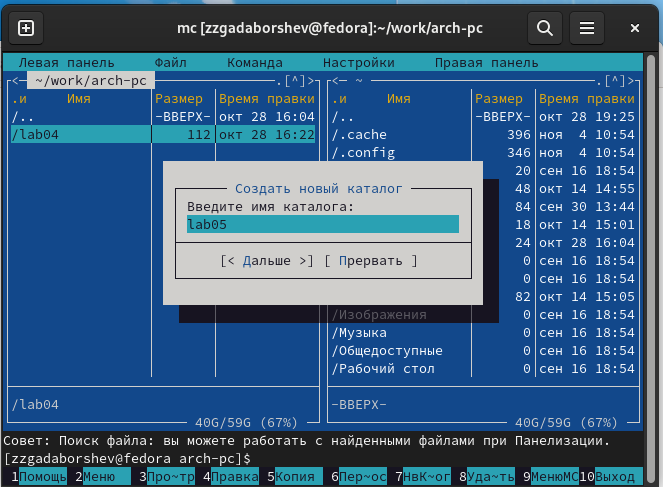{ #fig:002 width=70%, height=70% }

При помощи touch создал файл lab05-1.asm

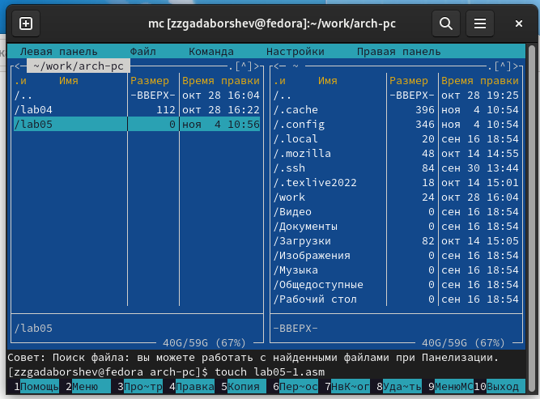{ #fig:003 width=70%, height=70% }

Открыл файл на редактирование клавишей F4, выбрал редактор mceditor, написал код программы из задания.

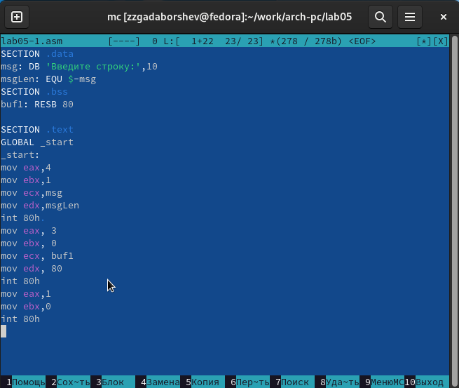{ #fig:004 width=70%, height=70% }

Открыл файл на просмотр клавишей F3 и убелился, что он содержит набранный код.

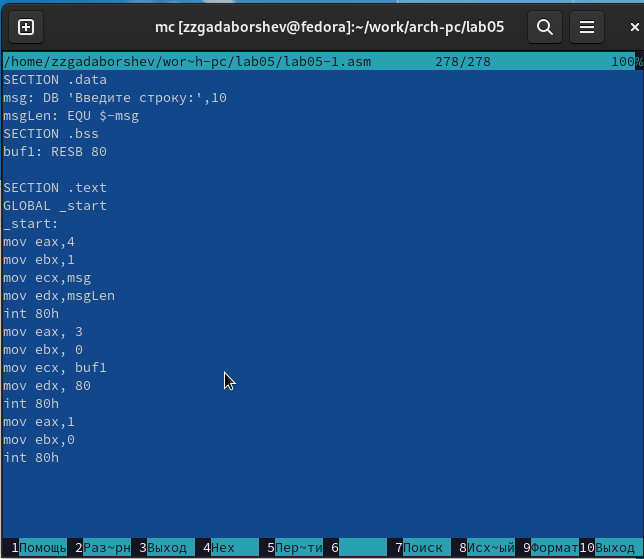{ #fig:005 width=70%, height=70% }

Транслировал файл программы в объектный файл, выполнил компановку объектного файла, получил исполняемый файл программы и провреил ее работу.

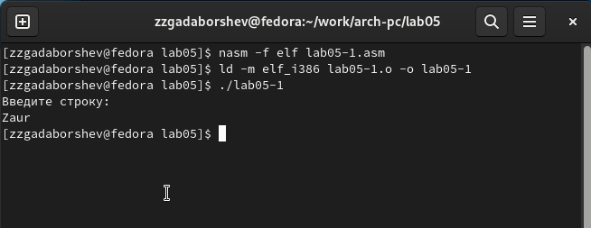{ #fig:006 width=70%, height=70% }

## Подключение внешнего файла in_out.asm

Для упрощения написания программ часто встречающиеся одинаковые участки кода
(такие как, например, вывод строки на экран или выход их программы) можно оформить
в виде подпрограмм и сохранить в отдельные файлы, а во всех нужных местах поставить
вызов нужной подпрограммы. Это позволяет сделать основную программу более удобной
для написания и чтения.

Для выполнения лабораторных работ используется файл in_out.asm, который содержит
следующие подпрограммы:

* slen – вычисление длины строки (используется в подпрограммах печати сообщения для определения количества выводимых байтов);

* sprint – вывод сообщения на экран, перед вызовом sprint в регистр eax необходимо записать выводимое сообщение (mov eax,<message>);

* sprintLF – работает аналогично sprint, но при выводе на экран добавляет к сообщению символ перевода строки;

* sread – ввод сообщения с клавиатуры, перед вызовом sread в регистр eax необходимо записать адрес переменной в которую введенное сообщение буд записано (mov eax,<buffer>) , в регистр ebx – длину вводимой строки (mov ebx,<N>);

* iprint – вывод на экран чисел в формате ASCII, перед вызовом iprint в регистр eax необходимо записать выводимое число (mov eax,<int>);

* iprintLF – работает аналогично iprint, но при выводе на экран после числа добавляет к символ перевода строки;

* atoi – функция преобразует ascii-код символа в целое число и записыает результат в регистр eax, перед вызовом atoi в регистр eax необходимо записать число (mov eax,<int>);

* quit – завершение программы.

Скачал файл in_out.asm и разместил его в рабочем каталоге. Для копирования используется клавиша F5.
Для перемещения используется клавиша F6.

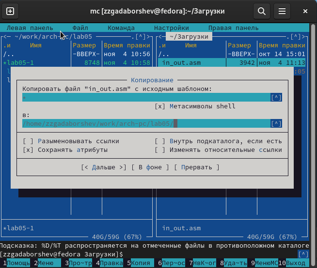{ #fig:007 width=70%, height=70% }

Скопировал lab05-1.asm в lab05-2.asm.

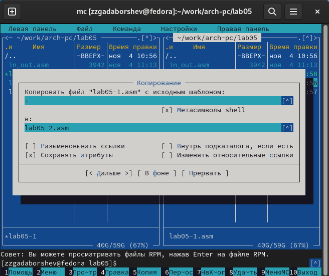{ #fig:008 width=70%, height=70% }

Написал код программы lab05-2.asm с использованием подпрограмм из
внешнего файла in_out.asm . Скомпилировал программу и провреил запуск.

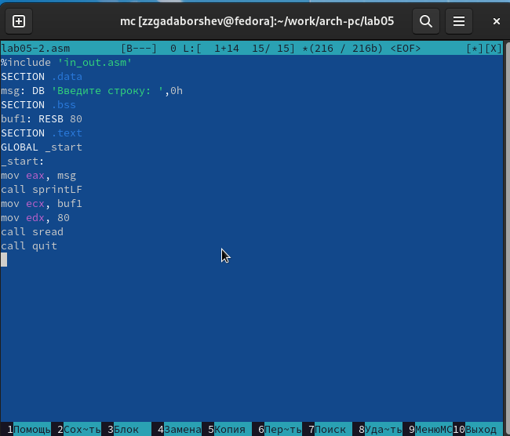{ #fig:009 width=70%, height=70% }

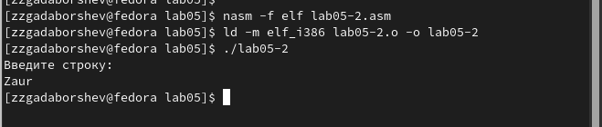{ #fig:010 width=70%, height=70% }

В файле lab5-2.asm заменил подпрограмму sprintLF на sprint. 
Заново собрал исполняеый файл. 
Теперь после вывода строки она не завершается символом перехода на новую строку.

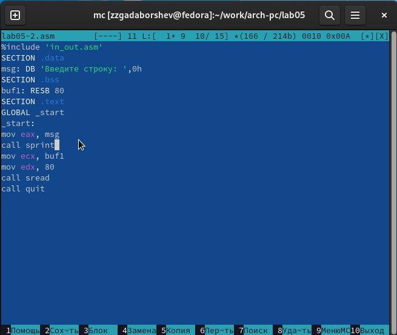{ #fig:011 width=70%, height=70% }

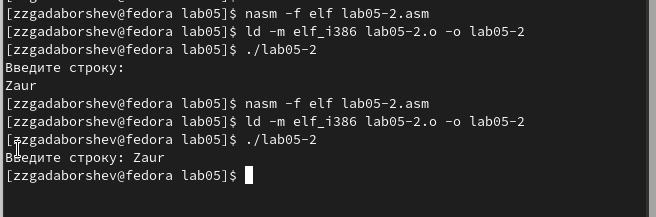{ #fig:012 width=70%, height=70% }

##  Задание для самостоятельной работы

Скопировал программу lab05-1.asm и измении код, так чтобы она работала по следующему алгоритму:

* вывести приглашение типа “Введите строку:”;

* ввести строку с клавиатуры;

* вывести введённую строку на экран.

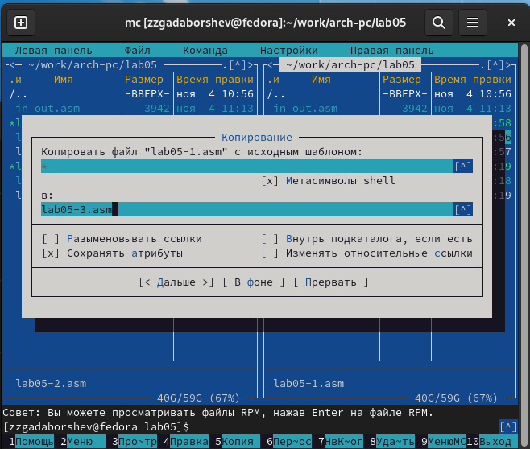{ #fig:013 width=70%, height=70% }

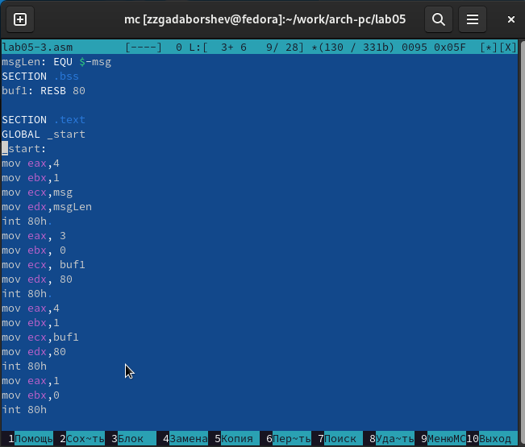{ #fig:014 width=70%, height=70% }

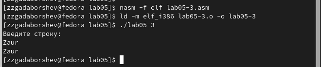{ #fig:015 width=70%, height=70% }

Аналогично скопировал программу lab05-2.asm и изменил код, но теперь использовал подпрограммы из файла in_out.asm.

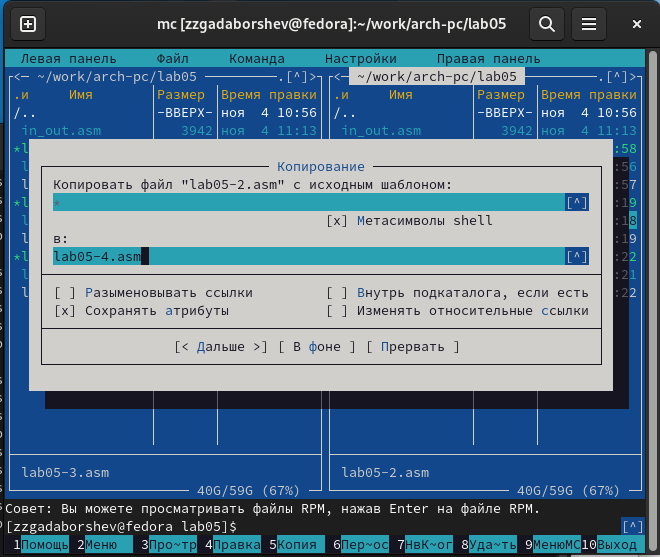{ #fig:016 width=70%, height=70% }

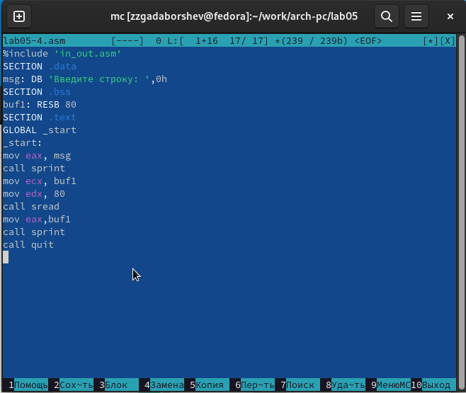{ #fig:017 width=70%, height=70% }

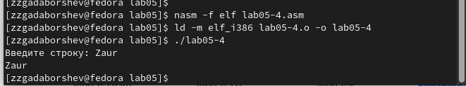{ #fig:018 width=70%, height=70% }

# Выводы

Научились писать базовые ассемблерные программы. Освоили ассемблерные инструкции mov и int.