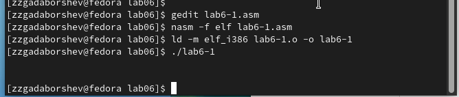
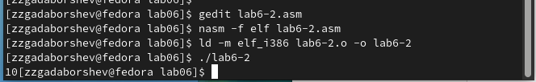

---
## Front matter
title: "Отчёт по лабораторной работе 6"
subtitle: "Арифметические операции в NASM."
author: "Гадаборшев Заур Закреевич	НПИбд-01-23"

## Generic otions
lang: ru-RU
toc-title: "Содержание"

## Bibliography
bibliography: bib/cite.bib
csl: pandoc/csl/gost-r-7-0-5-2008-numeric.csl

## Pdf output format
toc: true # Table of contents
toc-depth: 2
lof: true # List of figures
lot: true # List of tables
fontsize: 12pt
linestretch: 1.5
papersize: a4
documentclass: scrreprt
## I18n polyglossia
polyglossia-lang:
  name: russian
  options:
	- spelling=modern
	- babelshorthands=true
polyglossia-otherlangs:
  name: english
## I18n babel
babel-lang: russian
babel-otherlangs: english
## Fonts
mainfont: PT Serif
romanfont: PT Serif
sansfont: PT Sans
monofont: PT Mono
mainfontoptions: Ligatures=TeX
romanfontoptions: Ligatures=TeX
sansfontoptions: Ligatures=TeX,Scale=MatchLowercase
monofontoptions: Scale=MatchLowercase,Scale=0.9
## Biblatex
biblatex: true
biblio-style: "gost-numeric"
biblatexoptions:
  - parentracker=true
  - backend=biber
  - hyperref=auto
  - language=auto
  - autolang=other*
  - citestyle=gost-numeric
## Pandoc-crossref LaTeX customization
figureTitle: "Рис."
tableTitle: "Таблица"
listingTitle: "Листинг"
lofTitle: "Список иллюстраций"
lotTitle: "Список таблиц"
lolTitle: "Листинги"
## Misc options
indent: true
header-includes:
  - \usepackage{indentfirst}
  - \usepackage{float} # keep figures where there are in the text
  - \floatplacement{figure}{H} # keep figures where there are in the text
---

# Цель работы

Целью работы является освоение арифметических инструкций языка ассемблера NASM.

# Теоретическое введение

Большинство инструкций на языке ассемблера требуют обработки операндов. Адрес операнда предоставляет место, где хранятся данные, подлежащие обработке. Это могут быть
данные хранящиеся в регистре или в ячейке памяти. Далее рассмотрены все существующие
способы задания адреса хранения операндов – способы адресации.
Существует три основных способа адресации:

* Регистровая адресация – операнды хранятся в регистрах и в команде используются имена этих регистров, например: mov ax,bx.

* Непосредственная адресация – значение операнда задается непосредственно в команде, Например: mov ax,2.

* Адресация памяти – операнд задает адрес в памяти. В команде указывается символическое обозначение ячейки памяти, над содержимым которой требуется выполнить операцию.

Схема команды целочисленного сложения add (от англ. addition - добавление) выполняет
сложение двух операндов и записывает результат по адресу первого операнда.

Команда целочисленного вычитания sub (от англ. subtraction – вычитание) работает аналогично команде add.

Существуют специальные команды: inc (от англ. increment) и dec (от англ. decrement), которые увеличивают и уменьшают на 1 свой операнд.

Умножение и деление, в отличии от сложения и вычитания, для знаковых и беззнаковых
чисел производиться по-разному, поэтому существуют различные команды.
Для беззнакового умножения используется команда mul (от англ. multiply – умножение),
для знакового умножения используется команда imul.

Для деления, как и для умножения, существует 2 команды div (от англ. divide - деление) и idiv

# Выполнение лабораторной работы

## Символьные и численные данные в NASM

Создал каталог для программам лабораторной работы № 6, перешел в него и создал файл lab6-1.asm. 

Рассмотрим примеры программ вывода символьных и численных значений. 
Программы будут выводить значения, записанные в регистр eax.

В данной программе в регистр eax записывается символ 6 (mov eax,'6'), в регистр ebx символ 4 (mov ebx,'4').
Далее к значению в регистре eax прибавляем значение регистра ebx (add eax,ebx, результат сложения запишется в регистр eax). 
Далее выводим результат. 
Так как для работы функции sprintLF в регистр eax должен быть записан адрес, необходимо использовать дополнительную переменную. 
Для этого запишем значение регистра eax в переменную buf1 (mov [buf1],eax), 
а затем запишем адрес переменной buf1 в регистр eax (mov eax,buf1) и вызовем функцию sprintLF.

{ #fig:001 width=70%, height=70% }

{ #fig:002 width=70%, height=70% }

В данном случае при выводе значения регистра eax мы ожидаем увидеть число 10. 
Однако результатом будет символ j. 
Это происходит потому, что код символа 6 равен 00110110 в двоичном представлении (или 54 в десятичном представлении), 
а код символа 4 – 00110100 (52).  Команда add eax,ebx запишет в регистр eax сумму кодов – 01101010 (106), 
что в свою очередь является кодом символа j.

Далее изменяю текст программы и вместо символов, запишем в регистры числа. 

{ #fig:003 width=70%, height=70% }

{ #fig:004 width=70%, height=70% }

Как и в предыдущем случае при исполнении программы мы не получим число 10. В данном
случае выводится символ с кодом 10. Это символ конца строки (возврат каретки).
В консоле он не отображается, но добавляет пустую строку.

Как отмечалось выше, для работы с числами в файле in_out.asm реализованы 
подпрограммы для преобразования ASCII символов в числа и обратно. 
Преобразовал текст программы с использованием этих функций.

{ #fig:005 width=70%, height=70% }

{ #fig:006 width=70%, height=70% }

В результате работы программы мы получим число 106. В данном случае, как и в первом, 
команда add складывает коды символов ‘6’ и ‘4’ (54+52=106). 
Однако, в отличии от прошлой программы, функция iprintLF позволяет вывести число, 
а не символ, кодом которого является это число.

Аналогично предыдущему примеру изменим символы на числа.

{ #fig:007 width=70%, height=70% }

Функция iprintLF позволяет вывести число и операндами были числа (а не коды символов).
Поэтому получаем число 10.

{ #fig:008 width=70%, height=70% }

Заменил функцию iprintLF на iprint. Создал исполняемый файл и запустил его. 
Вывод отличается тем, что нет переноса строки.

{ #fig:009 width=70%, height=70% }

## Выполнение арифметических операций в NASM

 В качестве примера выполнения арифметических операций в NASM приведем 
программу вычисления арифметического выражения $$f(x) = (5 * 2 + 3)/3$$.

{ #fig:010 width=70%, height=70% }

{ #fig:011 width=70%, height=70% }

Изменил текст программы для вычисления выражения 
$$f(x) = (4 * 6 + 2)/5$$. 
Создал исполняемый файл и проверил его работу.

{ #fig:012 width=70%, height=70% }

{ #fig:013 width=70%, height=70% }

В качестве другого примера рассмотрим программу вычисления варианта задания по 
номеру студенческого билета.

В данном случае число, над которым необходимо проводить арифметические операции,
вводится с клавиатуры. Как отмечалось выше ввод с клавиатуры осуществляется 
в символьном виде и для корректной работы арифметических операций в NASM символы 
необходимо преобразовать в числа. Для этого может быть использована функция 
atoi из файла in_out.asm.

{ #fig:014 width=70%, height=70% }

{ #fig:015 width=70%, height=70% }

ответы на вопросы

1. Какие строки листинга отвечают за вывод на экран сообщения ‘Ваш вариант:’?

mov eax,rem – перекладывает в регистр значение переменной с фразой ‘Ваш вариант:’

call sprint – вызов подпрограммы вывода строки

2. Для чего используется следующие инструкции?

mov ecx, x 
mov edx, 80 
call sread
  
Считывает значение студбилета в переменную Х из консоли

3. Для чего используется инструкция “call atoi”?

Эта подпрограмма переводит введенные символы в числовой формат.

4. Какие строки листинга отвечают за вычисления варианта?

xor edx,edx
mov ebx,20
div ebx
inc edx

Здесь происходит деление номера студ билета на 20. 
В регистре edx хранится остаток, к нему прибавляется 1.

5. В какой регистр записывается остаток от деления при выполнении инструкции “div ebx”?

регистр edx

6. Для чего используется инструкция “inc edx”?

по формуле вычисления варианта нужно прибавить единицу

7. Какие строки листинга отвечают за вывод на экран результата вычислений? 

mov eax,edx – результат перекладывается в регистр eax

call iprintLF – вызов подпрограммы вывода

## Задание для самостоятельной работы

Написать программу вычисления выражения y = f(x). Программа должна выводить выражение 
для вычисления, выводить запрос на ввод значения x, 
вычислять заданное выражение в зависимости от введенного x, выводить результат вычислений. 
Вид функции f(x) выбрать из таблицы 6.3 вариантов заданий в соответствии с номером 
полученным при выполнении лабораторной работы. 
Создайте исполняемый файл и проверьте его работу для значений x1 и x2 из 6.3.

Получили вариант 14 - $$(x/2 + 8)*3$$  для $$x_{1}=1, x_{2}=4$$

{ #fig:016 width=70%, height=70% }

Если подставить 1 получается $$ (1/2 + 8)*3 = (0 + 8)*3 = 24 $$.

Если подставить 4 получается $$ (4/2 + 8)*3 = (2 + 8)*3 = 30 $$

{ #fig:017 width=70%, height=70% }

Программа считает верно.

# Выводы

Изучили работу с арифметическими операциями.
