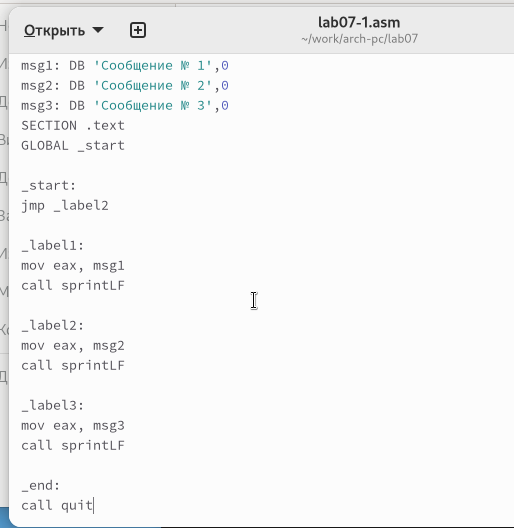

---
## Front matter
title: "Отчёт по лабораторной работе 7"
subtitle: "Команды безусловного и условного переходов в Nasm. Программирование ветвлений"
author: "Гадаборшев Заур Закреевич	НПИбд-01-23"

## Generic otions
lang: ru-RU
toc-title: "Содержание"

## Bibliography
bibliography: bib/cite.bib
csl: pandoc/csl/gost-r-7-0-5-2008-numeric.csl

## Pdf output format
toc: true # Table of contents
toc-depth: 2
lof: true # List of figures
lot: true # List of tables
fontsize: 12pt
linestretch: 1.5
papersize: a4
documentclass: scrreprt
## I18n polyglossia
polyglossia-lang:
  name: russian
  options:
	- spelling=modern
	- babelshorthands=true
polyglossia-otherlangs:
  name: english
## I18n babel
babel-lang: russian
babel-otherlangs: english
## Fonts
mainfont: PT Serif
romanfont: PT Serif
sansfont: PT Sans
monofont: PT Mono
mainfontoptions: Ligatures=TeX
romanfontoptions: Ligatures=TeX
sansfontoptions: Ligatures=TeX,Scale=MatchLowercase
monofontoptions: Scale=MatchLowercase,Scale=0.9
## Biblatex
biblatex: true
biblio-style: "gost-numeric"
biblatexoptions:
  - parentracker=true
  - backend=biber
  - hyperref=auto
  - language=auto
  - autolang=other*
  - citestyle=gost-numeric
## Pandoc-crossref LaTeX customization
figureTitle: "Рис."
tableTitle: "Таблица"
listingTitle: "Листинг"
lofTitle: "Список иллюстраций"
lotTitle: "Список таблиц"
lolTitle: "Листинги"
## Misc options
indent: true
header-includes:
  - \usepackage{indentfirst}
  - \usepackage{float} # keep figures where there are in the text
  - \floatplacement{figure}{H} # keep figures where there are in the text
---

# Цель работы

Целью работы является изучение команд условного и безусловного переходов. Приобретение навыков написания программ с использованием переходов. Знакомство с назначением и структурой файла листинга.

# Теоретическое введение

## Команды перехода

Для реализации ветвлений в ассемблере используются так называемые команды передачи
управления или команды перехода. Можно выделить 2 типа переходов:

* условный переход – выполнение или не выполнение перехода в определенную точку программы в зависимости от проверки условия.

* безусловный переход – выполнение передачи управления в определенную точку программы без каких-либо условий.

Безусловный переход выполняется инструкцией jmp (от англ. jump – прыжок), которая включает в себя адрес перехода, куда следует передать управление.

Как отмечалось выше, для условного перехода необходима проверка какого-либо условия.
В ассемблере команды условного перехода вычисляют условие перехода анализируя флаги
из регистра флагов.

Инструкция cmp является одной из инструкций, которая позволяет сравнить операнды и
выставляет флаги в зависимости от результата сравнения.
Инструкция cmp является командой сравнения двух операндов и имеет такой же формат,
как и команда вычитания.

## Листинг

Листинг (в рамках понятийного аппарата NASM) — это один из выходных файлов, созда-
ваемых транслятором. Он имеет текстовый вид и нужен при отладке программы, так как
кроме строк самой программы он содержит дополнительную информацию.

Итак, структура листинга:

* номер строки — это номер строки файла листинга (нужно помнить, что номер строки в файле листинга может не соответствовать номеру строки в файле с исходным текстом программы);

* адрес — это смещение машинного кода от начала текущего сегмента;

* машинный код представляет собой ассемблированную исходную строку в виде шестнадцатеричной последовательности. (например, инструкция int 80h начинается по смещению 00000020 в сегменте кода; далее идёт машинный код, в который ассемблируется инструкция, то есть инструкция int 80h ассемблируется в CD80 (в шестнадцатеричном представлении); CD80 — это инструкция на машинном языке, вызывающая прерывание ядра)

*  исходный текст программы — это просто строка исходной программы вместе с комментариями (некоторые строки на языке ассемблера, например, строки, содержащие только комментарии, не генерируют никакого машинного кода, и поля «смещение» и «исходный текст программы» в таких строках отсутствуют, однако номер строки им присваивается)

# Выполнение лабораторной работы

## Реализация переходов в NASM

Создал каталог для программам лабораторной работы № 7 и файл lab7-1.asm

Инструкция jmp в NASM используется для реализации безусловных переходов. Рассмотрим пример программы с использованием инструкции jmp.
Написал в файл lab7-1.asm текст программы из листинга 7.1.

{ #fig:001 width=70%, height=70% }

Создал исполняемый файл и запустил его.

{ #fig:002 width=70%, height=70% }

Инструкция jmp позволяет осуществлять переходы не только вперед но и назад. 
Изменим программу таким образом, чтобы она выводила сначала ‘Сообщение № 2’, потом ‘Сообщение № 1’ и завершала работу. 
Для этого в текст программы после вывода сообщения № 2 добавим инструкцию jmp с меткой _label1 (т.е. переход к инструкциям вывода сообщения № 1) и после вывода сообщения № 1 добавим инструкцию jmp с меткой _end 
(т.е. переход к инструкции call quit). 

Изменил текст программы в соответствии с листингом 7.2.

{ #fig:003 width=70%, height=70% }

{ #fig:004 width=70%, height=70% }

Изменил текст программы, изменив инструкции jmp, чтобы вывод программы был следующим:
```
Сообщение № 3
Сообщение № 2
Сообщение № 1
```

{ #fig:005 width=70%, height=70% }

{ #fig:006 width=70%, height=70% }

Использование инструкции jmp приводит к переходу в любом случае. 
Однако, часто при написании программ необходимо использовать условные переходы, 
т.е. переход должен происходить если выполнено какое-либо условие. 
В качестве примера рассмотрим программу, которая определяет и выводит на экран наибольшую из 3 целочисленных переменных: A,B и C. 
Значения для A и C задаются в программе, значение B вводиться с клавиатуры. 

Создал исполняемый файл и проверил его работу для разных значений B.

{ #fig:007 width=70%, height=70% }

{ #fig:008 width=70%, height=70% }

## Изучение структуры файлы листинга

Обычно nasm создаёт в результате ассемблирования только объектный файл. 
Получить файл листинга можно, указав ключ -l и задав имя файла листинга в командной строке. 

Создал файл листинга для программы из файла lab7-2.asm

{ #fig:009 width=70%, height=70% }

Внимательно ознакомился с его форматом и содержимым. 
Подробно объясню содержимое трёх строк файла листинга по выбору.

строка 203

* 28 - номер строки в подпрограмме

* 0000011C - адрес

* 3B0D[39000000]  - машинный код

* cmp ecx,[C] - код программы - сравнивает регистр ecx и переменную С

строка 204

* 29 - номер строки в подпрограмме

* 00000122 - адрес

* 7F0C - машинный код

* jg check_B - код программы - если >, то переход к метке check_B

строка 205

* 30 - номер строки в подпрограмме

* 00000124 - адрес

* 8B0D[39000000] - машинный код

* mov ecx,[C] - код программы - перекладывает в регистр ecx значение переменной С

Открыл файл с программой lab7-2.asm и в инструкции с двумя операндами удалил один операнд. 
Выполнил трансляцию с получением файла листинга.

{ #fig:010 width=70%, height=70% }

{ #fig:011 width=70%, height=70% }

Объектный файл не смог создаться из-за ошибки. Но получился листинг, где выделено место ошибки.

## Задание для самостоятельной работы

Напишите программу нахождения наименьшей из 3 целочисленных переменных a,b и c. 
Значения переменных выбрать из табл. 7.5 в соответствии с вариантом, полученным при выполнении лабораторной работы № 6.
Создайте исполняемый файл и проверьте его работу

для варианта 14 - 81, 22, 72

{ #fig:012 width=70%, height=70% }

{ #fig:013 width=70%, height=70% }

Напишите программу, которая для введенных с клавиатуры значений x и a вычисляет значение заданной функции f(x) и выводит результат вычислений. 
Вид функции f(x) выбрать из таблицы 7.6 вариантов заданий в соответствии с вариантом, полученным при выполнении лабораторной работы № 7. 
Создайте исполняемый файл и проверьте его работу для значений X и a из 7.6.

для варианта 14

$$
 \begin{cases}
	3a + 1, x < a
	\\   
	3x + 1, x \ge a
 \end{cases}
$$

Если подставить $x=2, a=3$ получается $3*3+1 = 10$.

Если подставить $x=4, a=2$ получается $3*4+1 = 13$.

{ #fig:014 width=70%, height=70% }

{ #fig:015 width=70%, height=70% }

# Выводы

Изучили команды условного и безусловного переходов, познакомились с фалом листинга.
