---
## Front matter
title: "Отчёт по лабораторной работе 9"
subtitle: "Понятие подпрограммы. Отладчик GDB."
author: "Гадаборшев Заур Закреевич	НПИбд-01-23"

## Generic otions
lang: ru-RU
toc-title: "Содержание"

## Bibliography
bibliography: bib/cite.bib
csl: pandoc/csl/gost-r-7-0-5-2008-numeric.csl

## Pdf output format
toc: true # Table of contents
toc-depth: 2
lof: true # List of figures
lot: true # List of tables
fontsize: 12pt
linestretch: 1.5
papersize: a4
documentclass: scrreprt
## I18n polyglossia
polyglossia-lang:
  name: russian
  options:
	- spelling=modern
	- babelshorthands=true
polyglossia-otherlangs:
  name: english
## I18n babel
babel-lang: russian
babel-otherlangs: english
## Fonts
mainfont: PT Serif
romanfont: PT Serif
sansfont: PT Sans
monofont: PT Mono
mainfontoptions: Ligatures=TeX
romanfontoptions: Ligatures=TeX
sansfontoptions: Ligatures=TeX,Scale=MatchLowercase
monofontoptions: Scale=MatchLowercase,Scale=0.9
## Biblatex
biblatex: true
biblio-style: "gost-numeric"
biblatexoptions:
  - parentracker=true
  - backend=biber
  - hyperref=auto
  - language=auto
  - autolang=other*
  - citestyle=gost-numeric
## Pandoc-crossref LaTeX customization
figureTitle: "Рис."
tableTitle: "Таблица"
listingTitle: "Листинг"
lofTitle: "Список иллюстраций"
lotTitle: "Список таблиц"
lolTitle: "Листинги"
## Misc options
indent: true
header-includes:
  - \usepackage{indentfirst}
  - \usepackage{float} # keep figures where there are in the text
  - \floatplacement{figure}{H} # keep figures where there are in the text
---

# Цель работы

Целью работы является приобретение навыков написания программ с использованием подпрограмм.
Знакомство с методами отладки при помощи GDB и его основными возможностями.

# Теоретическое введение

Отладка — это процесс поиска и исправления ошибок в программе. 
В общем случае его можно разделить на четыре этапа:

* обнаружение ошибки;

* поиск её местонахождения;

* определение причины ошибки;

* исправление ошибки.

GDB (GNU Debugger — отладчик проекта GNU) работает на многих UNIX-подобных
системах и умеет производить отладку многих языков программирования. 
GDB предлагает обширные средства для слежения и контроля за выполнением 
компьютерных программ. Отладчик не содержит собственного графического 
пользовательского интерфейса и использует стандартный текстовый интерфейс 
консоли. Однако для GDB существует несколько сторонних графических надстроек, 
а кроме того, некоторые интегрированные среды разработки
используют его в качестве базовой подсистемы отладки.
Отладчик GDB (как и любой другой отладчик) позволяет увидеть, что происходит 
«внутри» программы в момент её выполнения или что делает программа в 
момент сбоя.

Подпрограмма — это, как правило, функционально законченный участок кода, 
который можно многократно вызывать из разных мест программы. 
В отличие от простых переходов из подпрограмм существует возврат на команду, следующую за вызовом

# Выполнение лабораторной работы

## Реализация подпрограмм в NASM

Я создал каталог для выполнения лабораторной работы №9 и перешел в него. 

В качестве примера рассмотрим программу, которая вычисляет арифметическое 
выражение $f(x) = 2x+7$ с использованием подпрограммы calcul. 
В этом примере значение $x$ вводится с клавиатуры, а само выражение 
вычисляется в подпрограмме.

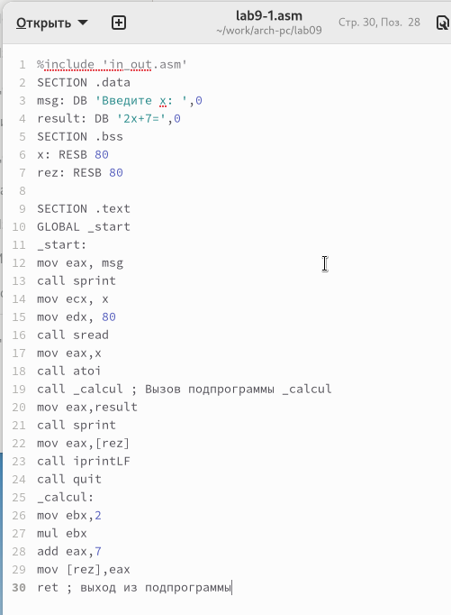{ #fig:001 width=70%, height=70% }

Первые строки программы отвечают за вывод сообщения на экран 
(с помощью вызова sprint), чтение данных, введенных с клавиатуры 
(с помощью вызова sread) и преобразование введенных данных из символьного 
вида в численный (с помощью вызова atoi).

После инструкции call _calcul, которая передает управление 
подпрограмме _calcul, будут выполнены инструкции, содержащиеся 
в подпрограмме.

Инструкция ret является последней в подпрограмме и ее выполнение приводит 
к возврату в основную программу к инструкции, следующей за инструкцией call, 
которая вызвала данную подпрограмму.

Последние строки программы реализуют вывод сообщения (с помощью вызова sprint),
 вывод результата вычисления (с помощью вызова iprintLF) и завершение 
 программы (с помощью вызова quit).

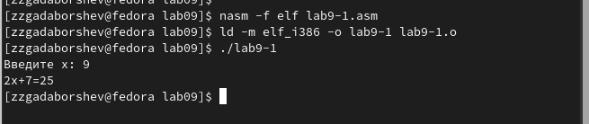{ #fig:002 width=70%, height=70% }

Изменил текст программы, добавив подпрограмму subcalcul в подпрограмму calcul, 
для вычисления выражения $f(g(x))$, где $x$ вводится с клавиатуры, 
$f(x) = 2x + 7, g(x) = 3x − 1$.

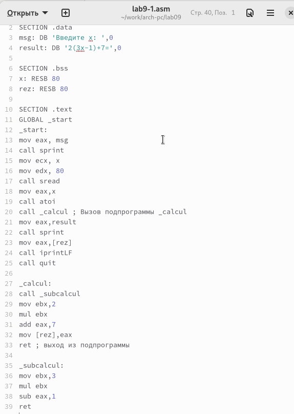{ #fig:003 width=70%, height=70% }

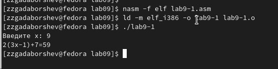{ #fig:004 width=70%, height=70% }

## Отладка программам с помощью GDB

Создал файл lab9-2.asm с текстом программы из Листинга 9.2. (Программа печати сообщения Hello world!).

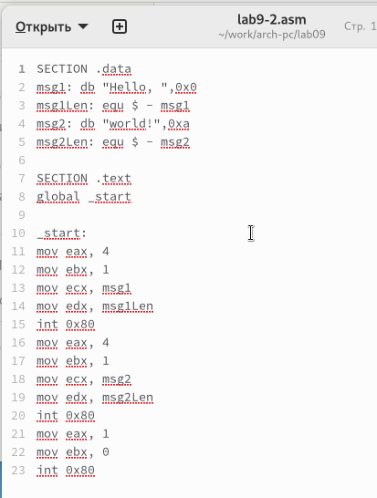{ #fig:005 width=70%, height=70% }

Получил исполняемый файл. Для работы с GDB в исполняемый файл необходимо 
добавить отладочную информацию, для этого трансляцию программ необходимо проводить с ключом ‘-g’.

Загрузил исполняемый файл в отладчик gdb.
Проверил работу программы, запустив ее в оболочке GDB с помощью команды run 
(сокращённо r).

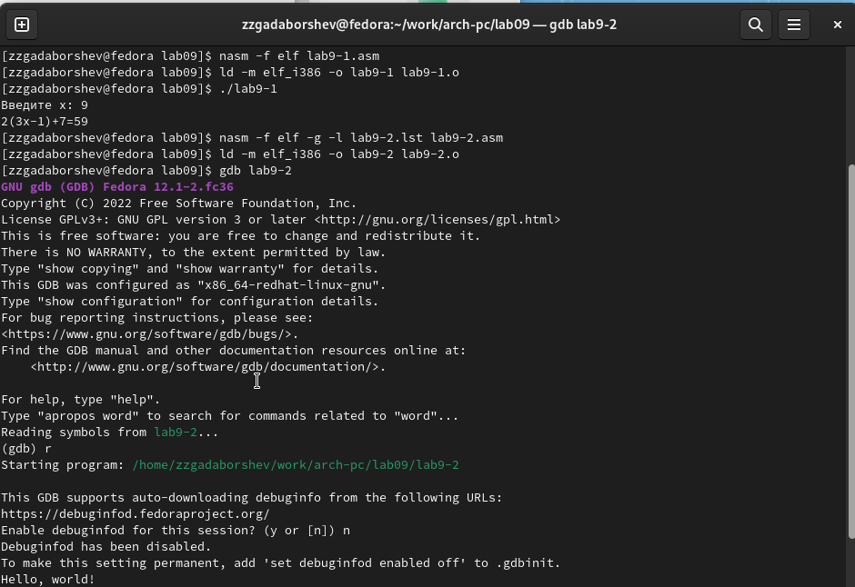{ #fig:006 width=70%, height=70% }

Для более подробного анализа программы установите брейкпоинт на метку
start, с которой начинается выполнение любой ассемблерной программы, и запустите её.
Посмотрите дисассимилированный код программы.

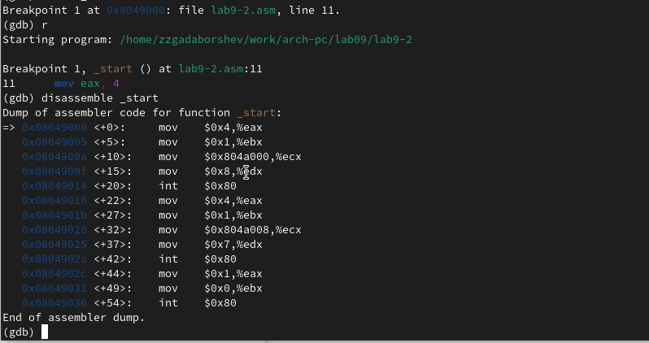{ #fig:007 width=70%, height=70% }

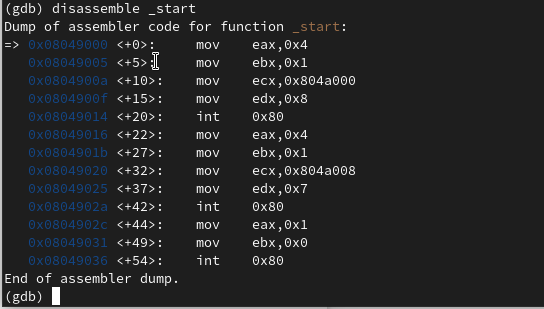{ #fig:008 width=70%, height=70% }

Установить точку останова можно командой break (кратко b). 
Типичный аргумент этой команды — место установки. Его можно задать или 
как номер строки программы (имеет смысл, если есть исходный файл, а программа 
компилировалась с информацией об отладке), или как имя метки, или как адрес. 
Чтобы не было путаницы с номерами, перед адресом ставится «звёздочка»

На предыдущих шагах была установлена точка остановки по имени метки (_start). 
Проверил это с помощью команды info breakpoints (кратко i b).
Установил еще одну точку остановки по адресу инструкции. 
Адрес инструкции можно увидеть в средней части экрана в левом столбце соответствующей
инструкции. Определил адрес предпоследней инструкции (mov ebx,0x0) и установил точку.

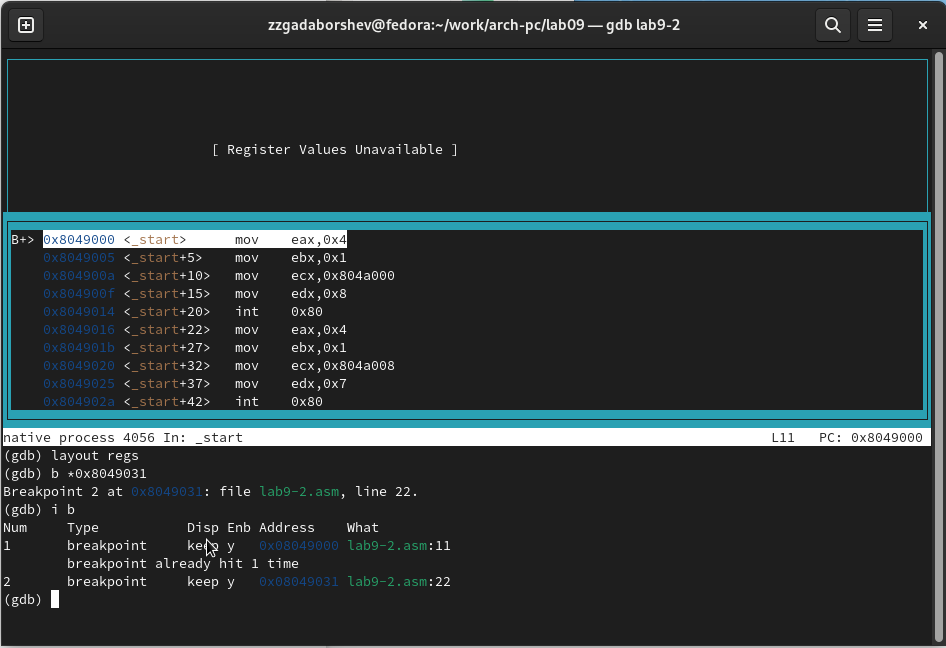{ #fig:009 width=70%, height=70% }

Отладчик может показывать содержимое ячеек памяти и регистров, а при
необходимости позволяет вручную изменять значения регистров и переменных.
Выполнил 5 инструкций с помощью команды stepi (или si) и проследил за
изменением значений регистров.

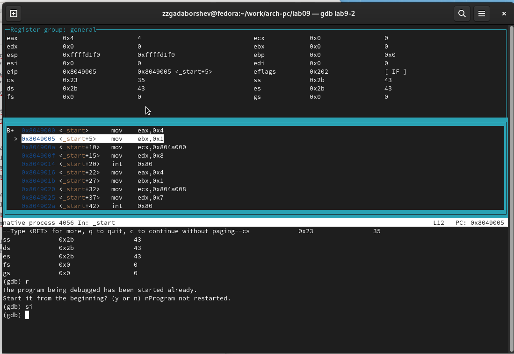{ #fig:010 width=70%, height=70% }

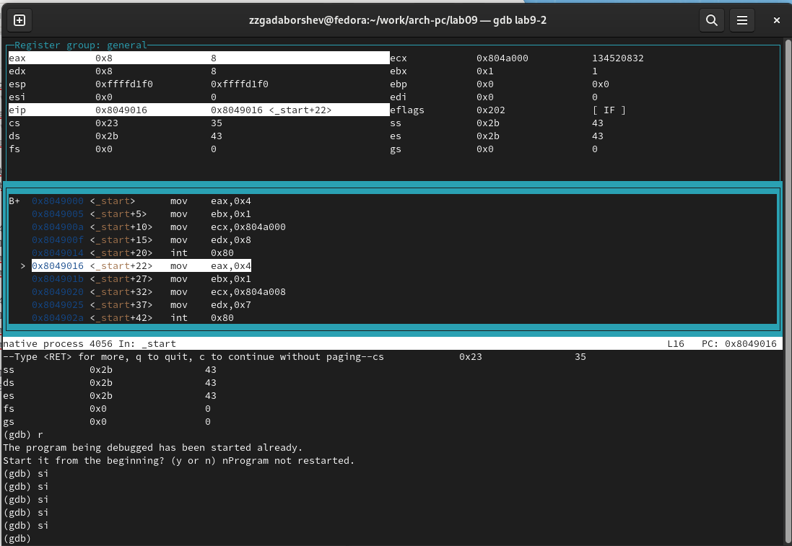{ #fig:011 width=70%, height=70% }

Посмотрел значение переменной msg1 по имени.
Посмотрел значение переменной msg2 по адресу.

Изменить значение для регистра или ячейки памяти можно с помощью команды set, 
задав ей в качестве аргумента имя регистра или адрес. 
Изменил первый символ переменной msg1.

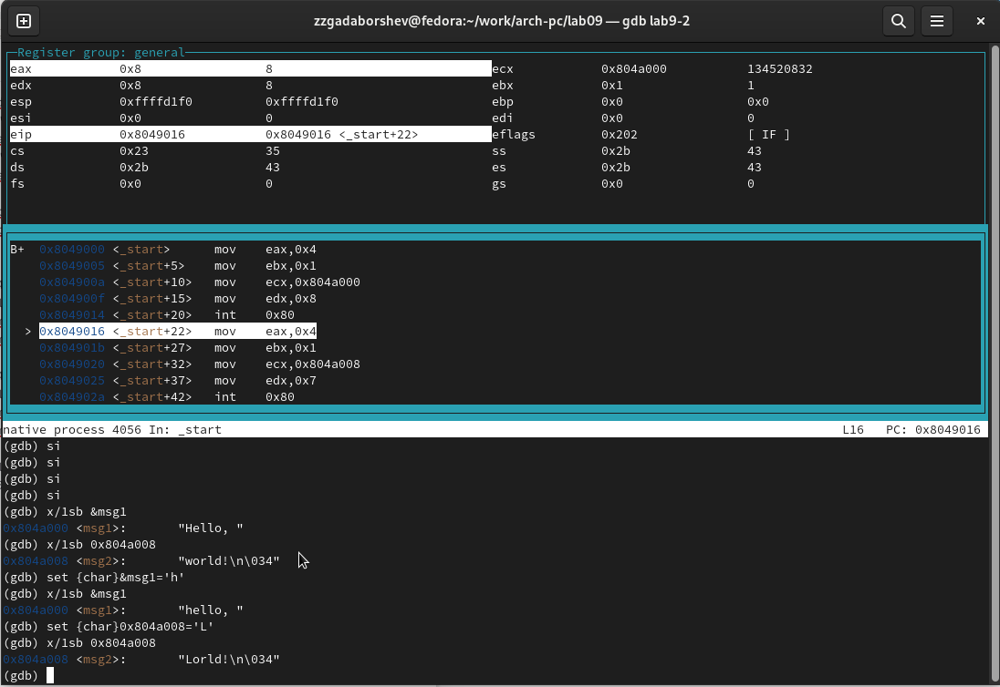{ #fig:012 width=70%, height=70% }

Вывел в различных форматах (в шестнадцатеричном формате, в двоичном формате и в символьном виде) 
значение регистра edx.

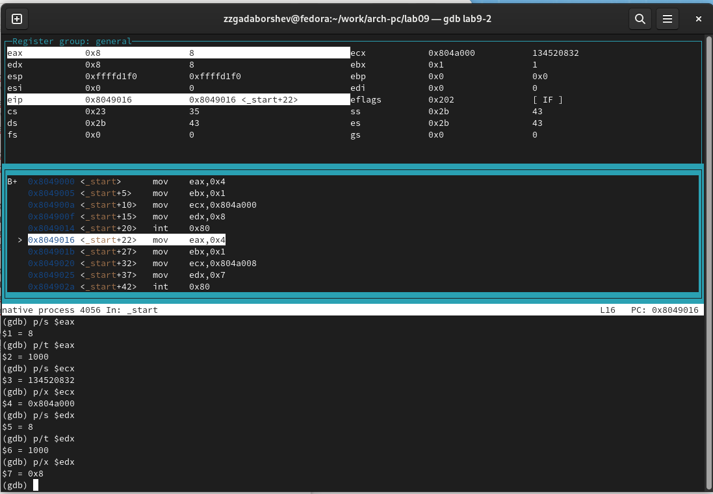{ #fig:013 width=70%, height=70% }

С помощью команды set изменил значение регистра ebx

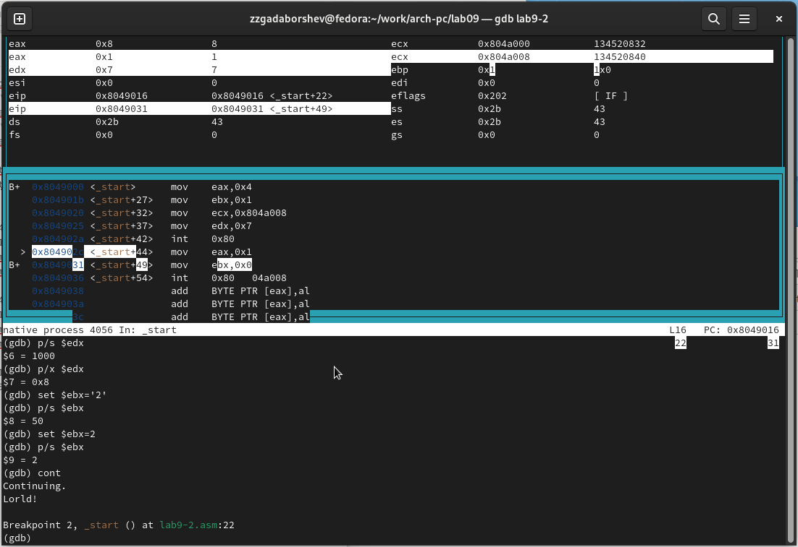{ #fig:014 width=70%, height=70% }

Скопировал файл lab8-2.asm, созданный при выполнении лабораторной работы №8, 
с программой выводящей на экран аргументы командной строки. Создал исполняемый файл.
Для загрузки в gdb программы с аргументами необходимо использовать ключ
--args. Загрузил исполняемый файл в отладчик, указав аргументы.

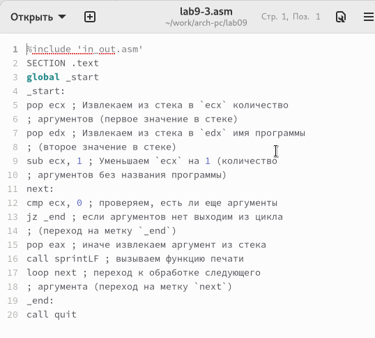{ #fig:015 width=70%, height=70% }

Для начала установил точку останова перед первой инструкцией в программе и запустил ее.

Адрес вершины стека храниться в регистре esp и по этому адресу располагается число равное количеству 
аргументов командной строки (включая имя программы).
Как видно, число аргументов равно 5 – это имя программы lab9-3 и 
непосредственно аргументы: аргумент1, аргумент, 2 и 'аргумент 3'.

Посмотрел остальные позиции стека – по адесу [esp+4] располагается адрес
в памяти где находиться имя программы, по адесу [esp+8] храниться адрес
первого аргумента, по аресу [esp+12] – второго и т.д.

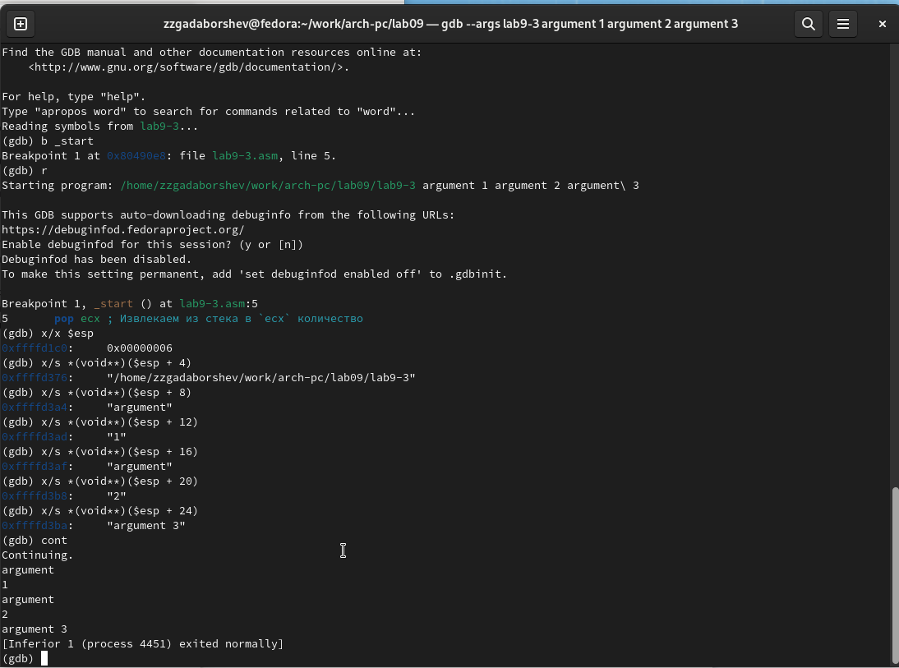{ #fig:016 width=70%, height=70% }

Объясню, почему шаг изменения адреса равен 4 ([esp+4], [esp+8], [esp+12] - 
шаг равен размеру переменной - 4 байтам.

## Задание для самостоятельной работы

Я переписал программу из лабораторной работы №8, чтобы вычислить 
значение функции f(x) в виде подпрограммы.

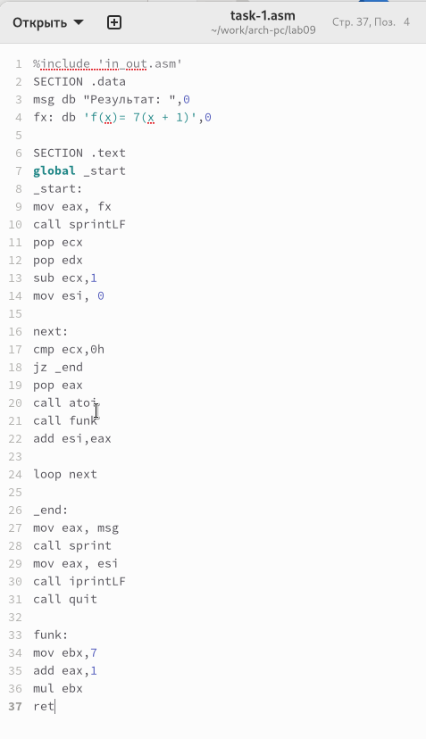{ #fig:017 width=70%, height=70% }

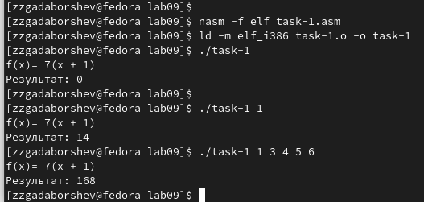{ #fig:018 width=70%, height=70% }

Приведенный ниже листинг программы вычисляет выражение $(3+2)*4+5$. 
Однако, при запуске, программа дает неверный результат. 
Я проверил это и решил использовать отладчик GDB для анализа изменений 
значений регистров и определения ошибки.

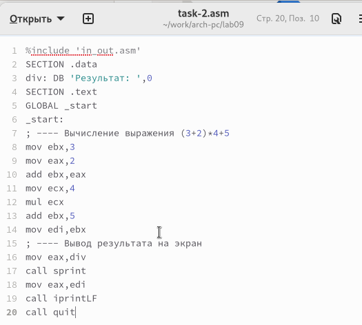{ #fig:019 width=70%, height=70% }

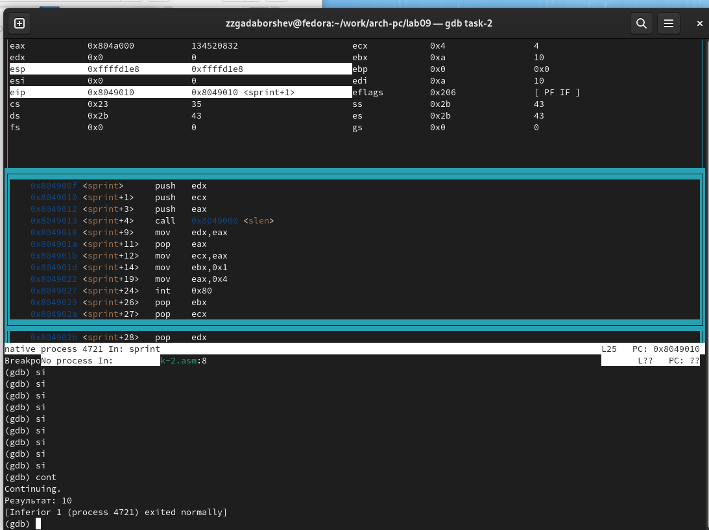{ #fig:020 width=70%, height=70% }

Я заметил, что порядок аргументов в инструкции add был перепутан и
 что при завершении работы, вместо eax, значение отправлялось в edi.
Вот исправленный код программы:

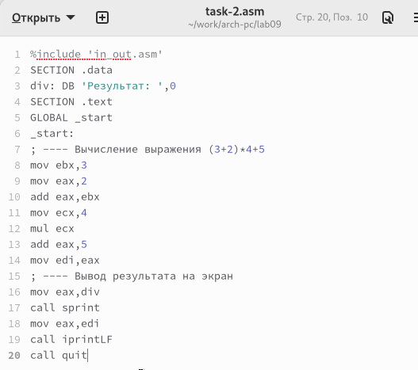{ #fig:021 width=70%, height=70% }

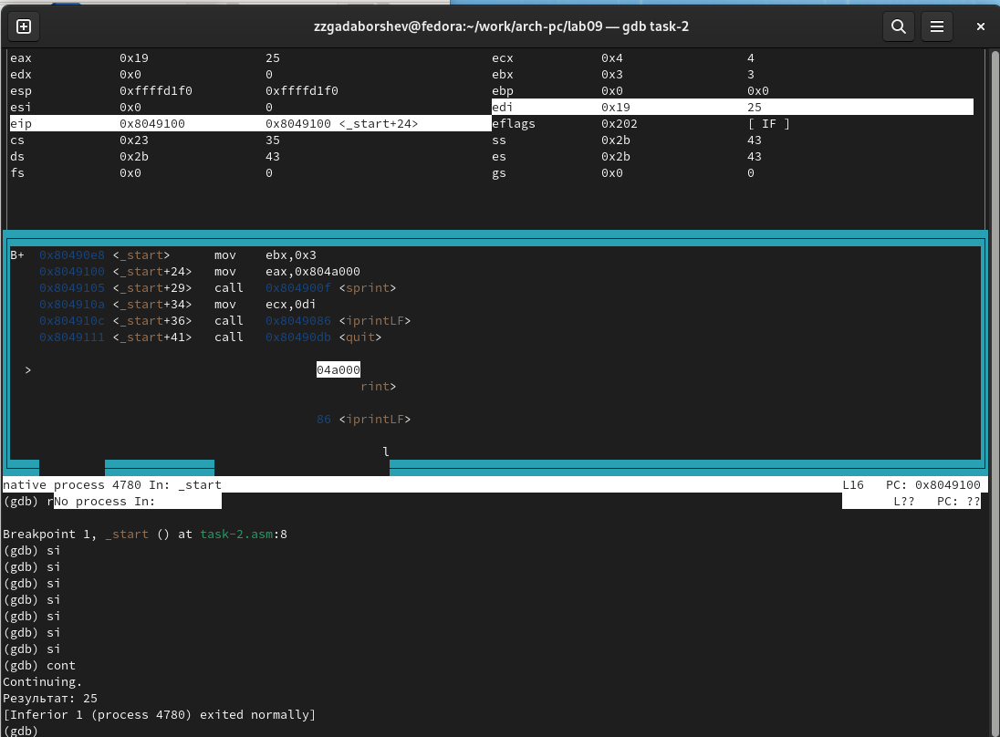{ #fig:022 width=70%, height=70% }

# Выводы

Освоили работy с подпрограммами и отладчиком.