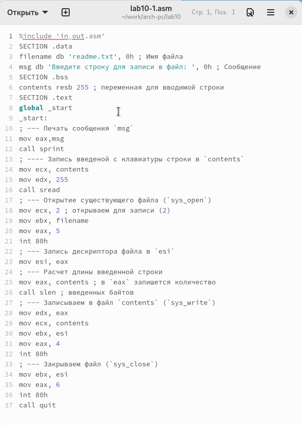
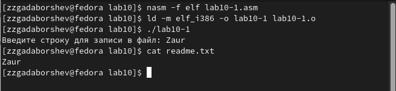
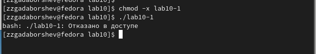
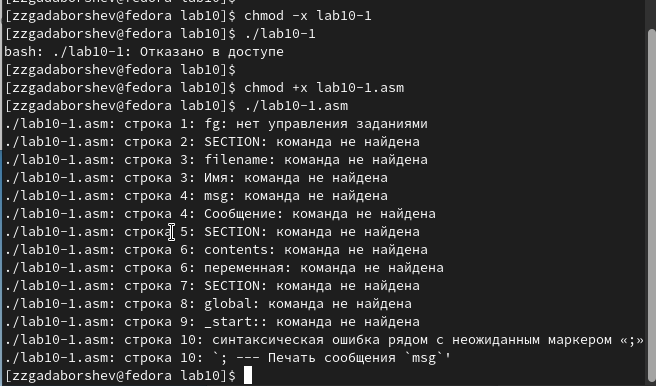
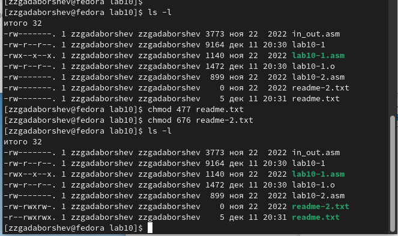
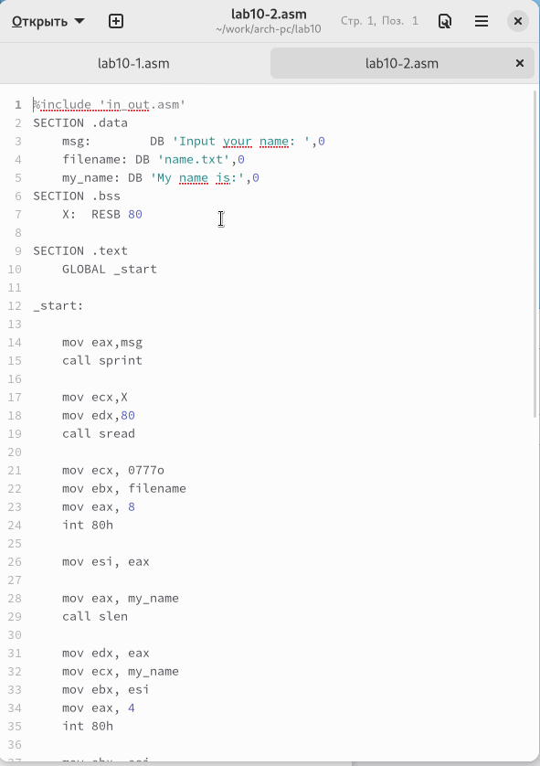
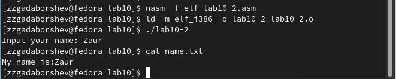

---
## Front matter
title: "Отчёт по лабораторной работе 10"
subtitle: "Работа с файлами средствами Nasm"
author: "Гадаборшев Заур Закреевич	НПИбд-01-23"

## Generic otions
lang: ru-RU
toc-title: "Содержание"

## Bibliography
bibliography: bib/cite.bib
csl: pandoc/csl/gost-r-7-0-5-2008-numeric.csl

## Pdf output format
toc: true # Table of contents
toc-depth: 2
lof: true # List of figures
lot: true # List of tables
fontsize: 12pt
linestretch: 1.5
papersize: a4
documentclass: scrreprt
## I18n polyglossia
polyglossia-lang:
  name: russian
  options:
	- spelling=modern
	- babelshorthands=true
polyglossia-otherlangs:
  name: english
## I18n babel
babel-lang: russian
babel-otherlangs: english
## Fonts
mainfont: PT Serif
romanfont: PT Serif
sansfont: PT Sans
monofont: PT Mono
mainfontoptions: Ligatures=TeX
romanfontoptions: Ligatures=TeX
sansfontoptions: Ligatures=TeX,Scale=MatchLowercase
monofontoptions: Scale=MatchLowercase,Scale=0.9
## Biblatex
biblatex: true
biblio-style: "gost-numeric"
biblatexoptions:
  - parentracker=true
  - backend=biber
  - hyperref=auto
  - language=auto
  - autolang=other*
  - citestyle=gost-numeric
## Pandoc-crossref LaTeX customization
figureTitle: "Рис."
tableTitle: "Таблица"
listingTitle: "Листинг"
lofTitle: "Список иллюстраций"
lotTitle: "Список таблиц"
lolTitle: "Листинги"
## Misc options
indent: true
header-includes:
  - \usepackage{indentfirst}
  - \usepackage{float} # keep figures where there are in the text
  - \floatplacement{figure}{H} # keep figures where there are in the text
---

# Цель работы

Целью работы является приобретение навыков написания программ для работы с файлами.

# Теоретическое введение

ОС GNU/Linux является многопользовательской операционной системой. И для обеспечения 
защиты данных одного пользователя от действий других пользователей существуют
специальные механизмы разграничения доступа к файлам. Кроме ограничения доступа, 
данный механизм позволяет разрешить другим пользователям доступ данным для совместной
работы.

Права доступа определяют набор действий (чтение, запись, выполнение), разрешённых
для выполнения пользователям системы над файлами. Для каждого файла пользователь
может входить в одну из трех групп: владелец, член группы владельца, все остальные. 
Для каждой из этих групп может быть установлен свой набор прав доступа. 
Владельцем файла является его создатель.

Набор прав доступа задается тройками битов и состоит из прав на чтение, запись и 
исполнение файла. В символьном представлении он имеет вид строк rwx, где вместо 
любого символа может стоять дефис. Всего возможно 8 комбинаций, приведенных в 
таблице 10.1. Буква означает наличие права (установлен в единицу второй бит триады 
r — чтение, первый бит w — запись, нулевой бит х — исполнение), а дефис означает 
отсутствие права (нулевое значение соответствующего бита). 
Также права доступа могут быть представлены как восьмеричное число. 
Так, права доступа rw- (чтение и запись, без исполнения) понимаются как три двоичные цифры 110 или как восьмеричная цифра 6.

Обработка файлов в операционной системе Linux осуществляется за счет использования
определенных системных вызовов. Для корректной работы и доступа к файлу при его от-
крытии или создании, файлу присваивается уникальный номер (16-битное целое число) –
дескриптор файла

# Выполнение лабораторной работы

Создал каталог для программам лабораторной работы № 10, перешел
в него и создал файлы lab10-1.asm, readme-1.txt и readme-2.txt

Написал в файл lab10-1.asm текст программы из листинга 10.1 (Программа
записи в файл сообщения). Создал исполняемый файл и проверил его работу.

{ #fig:001 width=70%, height=70% }

Программа запрашивает строку и перезаписыввет ее в файл readme.txt. 
Если файла нет, тогда строка никуда не запишется.

{ #fig:002 width=70%, height=70% }

С помощью команды chmod изменил права доступа к исполняемому файлу
lab10-1, запретив его выполнение. Попытался выполнить файл. 

Файл не запускается, поскольку запуск запрещен, снят атрибут х во всех трех позициях.

{ #fig:003 width=70%, height=70% }

С помощью команды chmod изменил права доступа к файлу lab10-1.asm с
исходным текстом программы, добавив права на исполнение. 
Попытался выполнить его.

Файл запускается и терминал пытается выполнить его содержимое как консольные команды.
Но инструкции ассемблера не являются командами терминала, поэтому появляются ошибки.
Тем не менее, если в такой файл написать команды терминала, то можно будет их выполнить путем запуска файла.

{ #fig:004 width=70%, height=70% }

Предоставил права доступа к файлам readme в соответствии с вариантом в таблице 10.4. 
Проверил правильность выполнения с помощью команды ls -l.

для варианта 14: ```r-x rwx rwx``` и ```110 111 110```

{ #fig:005 width=70%, height=70% }

## Задание для самостоятельной работы

Написал программу работающую по следующему алгоритму:

* Вывод приглашения “Как Вас зовут?”

* ввести с клавиатуры свои фамилию и имя

* создать файл с именем name.txt

* записать в файл сообщение “Меня зовут”

* дописать в файл строку введенную с клавиатуры

* закрыть файл

{ #fig:006 width=70%, height=70% }

{ #fig:007 width=70%, height=70% }

# Выводы

Освоили работy с файлами и правами доступа.